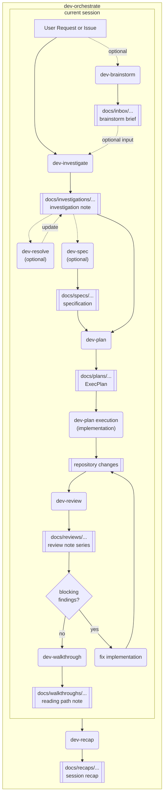

# dev-skills

Reusable agent skills for software development workflows.

## Overview

This repository contains focused agent skills for engineering work such as investigation, specification, planning, review, and recap. Each skill can be used on its own, or composed into a larger end-to-end workflow for repository-driven development.

- `dev-investigate`: repository research and technical analysis
- `dev-resolve`: best-effort inferred answers for open questions in documents and free-form text
- `dev-plan`: creation and management of ExecPlans
- `dev-walkthrough`: prioritized human reading paths for code and changes
- `dev-review`: two-pass review of changes or existing code
- `dev-spec`: software requirements and specification drafting
- `dev-recap`: detailed session recap and repeated work pattern analysis
- `dev-brainstorm`: free-form ideation backed by a living inbox note under `docs/inbox`
- `dev-orchestrate`: orchestration across the full workflow from investigation through recap, including resume and interrupt handling from existing workspace state

Each skill lives under `skills/` in its own directory and includes a `SKILL.md`, agent config, and supporting references. Use `dev-orchestrate` when you want the full workflow, or call individual skills directly when you need one focused operation. See `Skill Relationships` for the orchestration model and `Skills` for per-skill details.

## Skill Relationships

The repository is designed around an orchestrated end-to-end workflow, while still allowing each skill to be used independently. You can use `dev-orchestrate` to orchestrate the full flow, or invoke individual skills directly when you only need a specific step. The diagram below shows how skills and their main artifacts connect.



- The usual flow is `dev-investigate` first, optional refinement through `dev-resolve` or `dev-spec`, then planning and execution through `dev-plan`.
- `dev-review` runs first after implementation; if that review is clean, the workflow proceeds directly to `dev-walkthrough`.
- The workflow only loops through implementation and review again when `dev-review` found blocking issues and the fix pass actually changed code, tests, or runtime configuration in scope.
- In one completed `dev-orchestrate` cycle, `dev-walkthrough` and `dev-recap` are the final two phases, in that order, and each produces exactly one main artifact for that cycle.
- `dev-orchestrate` orchestrates the end-to-end flow, while each skill remains independently callable when you only need one step.
- `dev-orchestrate` supports `execution_mode=auto|local|subagents`, so the same orchestration can run either with phase subagents or entirely in the main thread.
- When a prior run stopped halfway or the repository already contains manual edits, `dev-orchestrate` should infer the furthest defensible completed phase from artifacts and current changes, then resume from there instead of restarting blindly.
- Artifacts are primarily emitted under `docs/investigations/...`, `docs/reviews/...`, `docs/walkthroughs/...`, `docs/recaps/...`, `docs/specs/...`, and `docs/plans/...`.
- `dev-recap` closes the workflow by summarizing the session, the work performed, and the artifacts produced.

## Installation

Install all skills into `~/.agents/skills` from the repository root:

```bash
./install.sh
```

Use a custom destination if needed:

```bash
./install.sh /path/to/destination
```

The script detects each directory under `skills/` that contains a `SKILL.md` and syncs it with `rsync`, excluding `.git/` and `.DS_Store`.

Uninstall the skills from the default destination:

```bash
./uninstall.sh
```

Use a custom destination if needed:

```bash
./uninstall.sh /path/to/destination
```

The uninstall script removes only the skill directories represented by this repository from the destination.

## Skills

### dev-investigate

`dev-investigate` is focused on repository investigation and analysis.

- Use cases: technical research, deep dives, root-cause analysis, background study
- Role: turns findings into structured investigation reports

### dev-resolve

`dev-resolve` is focused on resolving open questions with explicit, best-effort inference.

- Use cases: augmenting investigation notes, review outputs, specifications, and arbitrary text that still contains unresolved questions
- Role: preserves the original questions and appends labeled inferred answers with confidence and basis

### dev-plan

`dev-plan` supports the creation and management of ExecPlans.

- Use cases: complex features, significant refactors, execution planning, plan execution from an existing ExecPlan
- Role: accepts free-form requests, upstream research/specification documents, or an existing ExecPlan, then creates, updates, or executes the target plan without jumping straight into implementation
- Execution model: `Execute the plan` is the only trigger phrase and targets the latest plan implicitly; providing a dev-plan-generated plan file targets that specific plan explicitly
- References:
  - [OpenAI Cookbook](https://cookbook.openai.com/articles/codex_exec_plans)
  - [YouTube](https://www.youtube.com/watch?v=Gr41tYOzE20)

### dev-walkthrough

`dev-walkthrough` supports efficient human review and code reading preparation.

- Use cases: staged or unstaged changes, commit review, commit range review, PR review, feature reading, subsystem reading
- Role: converts raw diffs or code areas into a short ordered reading path with focus areas and watchpoints, then saves it as a markdown note under `$PWD/docs/walkthroughs`
- Artifact links: use repo-local relative Markdown links so VSCode users can click from the note into source files and directories

### dev-review

`dev-review` supports both change review and existing code review.

- Use cases: staged or unstaged review, commit review, branch review, PR review, feature review, file review, directory review
- Role: uses `change-review` for diffs and `code-review` for existing code areas, then applies a broader second pass for intent, security, regression, testing, operations, and AI readability, always consults prior same-target review artifacts, and saves only net-new findings or material status changes to a markdown note under `$PWD/docs/reviews`
- Review artifact naming: if the same target is reviewed again, continue the existing review note filename as a numbered series instead of inventing a new unrelated name
- Artifact links: use repo-local relative Markdown links so VSCode users can click from the note into source files and directories

### dev-spec

`dev-spec` supports software requirements definition and specification drafting.

- Use cases: requirement definition, spec drafting, assumption and constraint management
- Role: converts requests or research into implementation-ready specifications

### dev-recap

`dev-recap` is focused on preserving the current session as a detailed handoff note.

- Use cases: session recap, handoff note creation, full conversation summary, workflow repetition analysis, Agent Skill opportunity discovery
- Role: reconstructs the session chronologically, records concrete actions and outcomes, updates an existing same-session recap when appropriate instead of duplicating it, appends repeated work pattern analysis, and recommends recurring patterns that should become Agent Skills

### dev-brainstorm

`dev-brainstorm` is focused on open-ended discussion and idea development while maintaining a canonical inbox note that can feed the next workflow step.

- Use cases: free-form brainstorming, vague request refinement, exploratory discussion, turning loose text or files into a concept-oriented brief
- Role: creates or updates a note under `$PWD/docs/inbox`, extracts topics from explicit input or the current session, and continuously distills the conversation into what the user wants to do next, why it matters, core concepts, constraints, options, tradeoffs, and open questions for `dev-orchestrate` or `dev-investigate`; if the user explicitly names code paths to consider, those can be preserved as user-provided anchors

### dev-orchestrate

`dev-orchestrate` is focused on orchestrating the full multi-skill workflow.

- Use cases: end-to-end work that should start with investigation, continue through planning and implementation, then end with review, reading guidance, and session recap; also recovery of interrupted runs or manual in-flight work
- Role: keeps the main thread as dev-orchestrate, resolves `execution_mode=auto|local|subagents` from exact tokens or clear natural language, documents canonical execution-mode intents in English while still interpreting equivalent phrasing in the user's language semantically, asks one short clarification question when execution-style wording is ambiguous, dispatches each phase through a subagent or locally without changing the workflow contract, preserves the artifact chain across notes, specs, plans, reviews, and recap, infers the current phase from artifacts and repository changes when resuming, loops through review and fix passes until blocking issues are resolved before running `dev-walkthrough`, and guarantees exactly one `dev-walkthrough` artifact and one `dev-recap` artifact at the end of each completed cycle

## License

MIT
