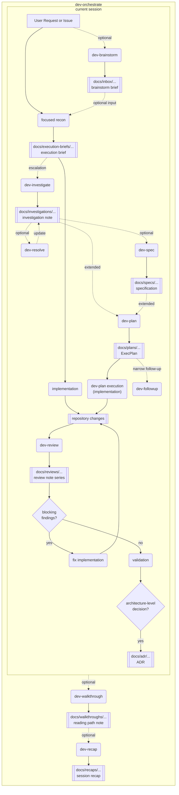

# dev-skills

Reusable agent skills for software development workflows.

## Overview

This repository contains focused agent skills for engineering work such as investigation, specification, planning, review, recap, and architecture decision capture. Each skill can be used on its own, or composed into a larger end-to-end workflow for repository-driven development.

- `dev-investigate`: repository research and technical analysis
- `dev-resolve`: best-effort inferred answers for open questions in documents and free-form text
- `dev-plan`: heavyweight creation and management of ExecPlans for extended workstreams
- `dev-walkthrough`: prioritized human reading paths for code and changes
- `dev-review`: two-pass review of changes or existing code
- `dev-spec`: specification drafting for work that needs a fixed requirement boundary before implementation
- `dev-followup`: sync an existing ExecPlan-led workstream after narrow follow-up changes
- `dev-recap`: detailed session recap and repeated work pattern analysis
- `dev-brainstorm`: free-form ideation backed by a living inbox note under `docs/inbox`
- `dev-orchestrate`: local-first orchestration across a lightweight execution-brief workflow, with escalation to heavier skills only when needed

Each skill lives under `skills/` in its own directory and includes a `SKILL.md`, agent config, and supporting references. Use `dev-orchestrate` when you want the local-first autonomous implementation loop, or call individual skills directly when you need one focused operation. See `Skill Relationships` for the orchestration model and `Skills` for per-skill details.

## Skill Relationships

The repository is designed around a lightweight default workflow with deliberate escalation to heavier artifacts only when risk, ambiguity, or restartability justify them. You can use `dev-orchestrate` to run the local-first loop, or invoke individual skills directly when you only need a specific step. The diagram below shows how skills and their main artifacts connect.



- The default flow is lightweight: focused recon, compact `execution brief`, implementation, review, validation, and close.
- `dev-investigate`, `dev-spec`, and `dev-plan` are escalation steps for extended or risky work, not mandatory first steps for every task.
- `dev-review` remains the required post-implementation gate for repository-changing work.
- The workflow only loops through implementation and review again when `dev-review` found blocking issues and the fix pass actually changed code, tests, or runtime configuration in scope.
- `dev-followup` is only for narrow follow-up work on an existing ExecPlan-led workstream.
- Architecture-level decisions can be promoted into ADRs under `docs/adr/...`, while task-local decisions stay in the `execution brief` or ExecPlan.
- `dev-walkthrough` and `dev-recap` are optional downstream artifacts, not mandatory completion steps for every run.
- `dev-orchestrate` supports `execution_mode=auto|local|subagents`, but the default intent is local-first orchestration with subagents used selectively.
- When a prior run stopped halfway or the repository already contains manual edits, `dev-orchestrate` should infer the furthest defensible completed gate from artifacts and current changes, then resume from there instead of restarting blindly.
- Artifacts can be emitted under `docs/execution-briefs/...`, `docs/investigations/...`, `docs/specs/...`, `docs/plans/...`, `docs/reviews/...`, `docs/adr/...`, `docs/walkthroughs/...`, and `docs/recaps/...`.

## Installation

Install all skills into `~/.agents/skills` from the repository root:

```bash
./install.sh
```

Use a custom destination if needed:

```bash
./install.sh /path/to/destination
```

The script detects each directory under `skills/` that contains a `SKILL.md` and syncs it with `rsync`, excluding `.git/` and `.DS_Store`.

Uninstall the skills from the default destination:

```bash
./uninstall.sh
```

Use a custom destination if needed:

```bash
./uninstall.sh /path/to/destination
```

The uninstall script removes only the skill directories represented by this repository from the destination.

## Skills

### dev-investigate

`dev-investigate` is focused on repository investigation and analysis.

- Use cases: technical research, deep dives, root-cause analysis, background study, or escalation when focused recon is not enough
- Role: turns findings into structured investigation reports for extended or higher-risk work

### dev-resolve

`dev-resolve` is focused on resolving open questions with explicit, best-effort inference.

- Use cases: augmenting investigation notes, review outputs, specifications, and arbitrary text that still contains unresolved questions
- Role: preserves the original questions and appends labeled inferred answers with confidence and basis

### dev-plan

`dev-plan` supports the creation and management of ExecPlans.

- Use cases: complex features, significant refactors, migrations, contract changes, execution planning, plan execution from an existing ExecPlan
- Role: serves as the heavyweight planning path for extended workstreams, accepts free-form requests, upstream research/specification documents, or an existing ExecPlan, then creates, updates, or executes the target plan without jumping straight into implementation
- Execution model: `Execute the plan` is the only trigger phrase and targets the latest plan implicitly; providing a dev-plan-generated plan file targets that specific plan explicitly
- References:
  - [OpenAI Cookbook](https://cookbook.openai.com/articles/codex_exec_plans)
  - [YouTube](https://www.youtube.com/watch?v=Gr41tYOzE20)

### dev-walkthrough

`dev-walkthrough` supports efficient human review and code reading preparation.

- Use cases: staged or unstaged changes, commit review, commit range review, PR review, feature reading, subsystem reading
- Role: converts raw diffs or code areas into a short ordered reading path with focus areas and watchpoints, then saves it as a markdown note under `$PWD/docs/walkthroughs`
- Artifact links: use repo-local relative Markdown links so VSCode users can click from the note into source files and directories

### dev-review

`dev-review` supports both change review and existing code review.

- Use cases: staged or unstaged review, commit review, branch review, PR review, feature review, file review, directory review
- Role: uses `change-review` for diffs and `code-review` for existing code areas, then applies a broader second pass for intent, security, regression, testing, operations, and AI readability, always consults prior same-target review artifacts, and saves only net-new findings or material status changes to a markdown note under `$PWD/docs/reviews`
- Review artifact naming: if the same target is reviewed again, continue the existing review note filename as a numbered series instead of inventing a new unrelated name
- Artifact links: use repo-local relative Markdown links so VSCode users can click from the note into source files and directories

### dev-spec

`dev-spec` supports software requirements definition and specification drafting.

- Use cases: requirement definition, spec drafting, assumption and constraint management when the requirement boundary needs to be fixed before implementation
- Role: converts requests or research into implementation-ready specifications for work that benefits from an explicit saved spec

### dev-followup

`dev-followup` is focused on keeping an existing ExecPlan-led workstream aligned after narrow post-implementation changes.

- Use cases: follow-up fixes, refinements, small behavior tweaks, UI adjustments, and doc synchronization for an already planned or already implemented extended feature
- Role: updates exactly one primary ExecPlan in place, refreshes its living sections to match the current implementation and validations, records only commands that were actually run, and updates spec, walkthrough, or recap artifacts only when propagation rules justify it; lightweight execution-brief follow-up stays in `dev-orchestrate`

### dev-recap

`dev-recap` is focused on preserving the current session as a detailed handoff note.

- Use cases: session recap, handoff note creation, full conversation summary, workflow repetition analysis, Agent Skill opportunity discovery
- Role: reconstructs the session chronologically, records concrete actions and outcomes, updates an existing same-session recap when appropriate instead of duplicating it, appends repeated work pattern analysis, and recommends recurring patterns that should become Agent Skills

### dev-brainstorm

`dev-brainstorm` is focused on open-ended discussion and idea development while maintaining a canonical inbox note that can feed the next workflow step.

- Use cases: free-form brainstorming, vague request refinement, exploratory discussion, turning loose text or files into a concept-oriented brief
- Role: creates or updates a note under `$PWD/docs/inbox`, extracts topics from explicit input or the current session, and continuously distills the conversation into what the user wants to do next, why it matters, core concepts, constraints, options, tradeoffs, and open questions for `dev-orchestrate` or `dev-investigate`; if the user explicitly names code paths to consider, those can be preserved as user-provided anchors

### dev-orchestrate

`dev-orchestrate` is focused on orchestrating the full multi-skill workflow.

- Use cases: local-first autonomous implementation work, recovery of interrupted runs or manual in-flight work, escalation to heavyweight investigation/spec/plan phases when risk or ambiguity justifies them, and reopening an ExecPlan-led workstream when later narrow follow-up changes arrive
- Role: keeps the main thread as `dev-orchestrate`, resolves `execution_mode=auto|local|subagents`, defaults to a lightweight flow built around `docs/execution-briefs/...`, escalates to `dev-investigate`, `dev-spec`, or `dev-plan` only when needed, preserves the current source of truth while resuming, loops through review and fix passes until blocking issues are resolved, promotes architecture-level decisions into ADRs under `docs/adr/...` when appropriate, and uses `dev-followup` only for ExecPlan-led follow-up work

## License

MIT
