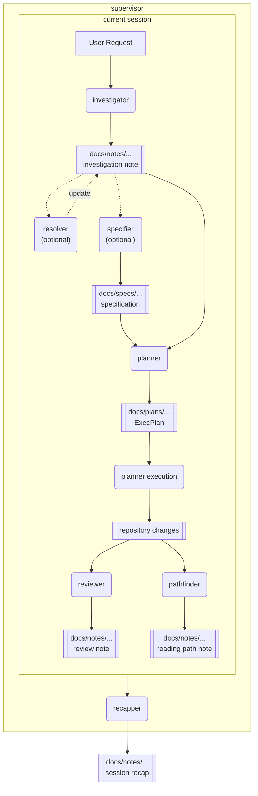

# My Skills Repository

This repository is my collection of agent skills.

## Overview

This repository contains a set of focused agent skills that can be used independently or combined into a larger workflow.

Each skill lives in its own directory and includes a `SKILL.md`, agent config, and supporting references. See `Skill Relationships` for how the skills connect, and `Skills` for per-skill details.

## Skill Relationships

The repository is designed around a supervised end-to-end workflow, while still allowing each skill to be used independently. You can use `supervisor` to orchestrate the full flow, or invoke individual skills directly when you only need a specific step. The diagram below shows how skills and their main artifacts connect.



- `supervisor` wraps the full workflow, coordinates which skills run, and closes the session with `recapper`.
- `investigator` is the default starting point for free-form requests.
- `resolver` and `specifier` refine upstream inputs before planning when needed.
- `investigator`, `reviewer`, `pathfinder`, and `recapper` primarily emit notes under `docs/notes/...`.
- `specifier` emits specs under `docs/specs/...`.
- `planner` has two roles: create/update the ExecPlan under `docs/plans/...`, then execute it once explicitly authorized.
- `reviewer` and `pathfinder` are downstream read-focused steps after implementation and can run side by side.
- `recapper` closes the workflow by summarizing the session as a whole, including the request, the work performed, and any artifacts created along the way.

## Installation

Install all skills into `~/.agents/skills` from the repository root:

```bash
./install.sh
```

Use a custom destination if needed:

```bash
./install.sh /path/to/destination
```

The script detects each top-level directory that contains a `SKILL.md` and syncs it with `rsync`, excluding `.git/` and `.DS_Store`.

## Skills

### Investigator

`investigator` is focused on repository investigation and analysis.

- Use cases: technical research, deep dives, root-cause analysis, background study
- Role: turns findings into structured investigation reports

### Resolver

`resolver` is focused on resolving open questions with explicit, best-effort inference.

- Use cases: augmenting investigation notes, review outputs, specifications, and arbitrary text that still contains unresolved questions
- Role: preserves the original questions and appends labeled inferred answers with confidence and basis

### Planner

`planner` supports the creation and management of ExecPlans.

- Use cases: complex features, significant refactors, execution planning, plan execution from an existing ExecPlan
- Role: accepts free-form requests, upstream research/specification documents, or an existing ExecPlan, then creates, updates, or executes the target plan without jumping straight into implementation
- Execution model: `Execute the plan` is the only trigger phrase and targets the latest plan implicitly; providing a planner-generated plan file targets that specific plan explicitly
- References:
  - [OpenAI Cookbook](https://cookbook.openai.com/articles/codex_exec_plans)
  - [YouTube](https://www.youtube.com/watch?v=Gr41tYOzE20)

### Pathfinder

`pathfinder` supports efficient human review and code reading preparation.

- Use cases: staged or unstaged changes, commit review, commit range review, PR review, feature reading, subsystem reading
- Role: converts raw diffs or code areas into a short ordered reading path with focus areas and watchpoints, then saves it as a markdown note under `$PWD/docs/notes`
- Artifact links: use repo-local relative Markdown links so VSCode users can click from the note into source files and directories

### Reviewer

`reviewer` supports both change review and existing code review.

- Use cases: staged or unstaged review, commit review, branch review, PR review, feature review, file review, directory review
- Role: uses `change-review` for diffs and `code-review` for existing code areas, then applies a broader second pass for intent, security, regression, testing, operations, and AI readability, and saves the review as a markdown note under `$PWD/docs/notes`
- Artifact links: use repo-local relative Markdown links so VSCode users can click from the note into source files and directories

### Specifier

`specifier` supports software requirements definition and specification drafting.

- Use cases: requirement definition, spec drafting, assumption and constraint management
- Role: converts requests or research into implementation-ready specifications

### Recapper

`recapper` is focused on preserving the current session as a detailed handoff note.

- Use cases: session recap, handoff note creation, full conversation summary, workflow repetition analysis
- Role: reconstructs the session chronologically, records concrete actions and outcomes, and appends repeated work pattern analysis

### Supervisor

`supervisor` is focused on orchestrating the full multi-skill workflow.

- Use cases: end-to-end work that should start with investigation, continue through planning and implementation, then end with review, reading guidance, and session recap
- Role: keeps the main thread as supervisor, delegates each phase to a subagent when available, and preserves the artifact chain across notes, specs, plans, reviews, and recap

## License

MIT
